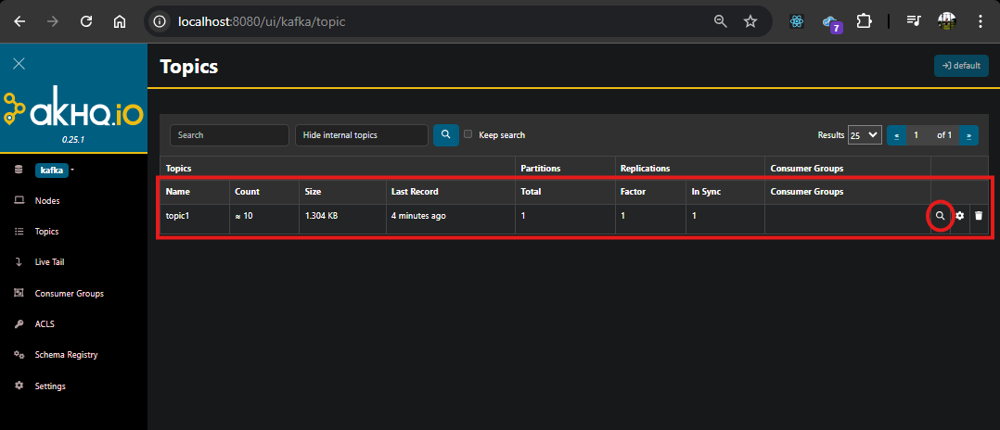
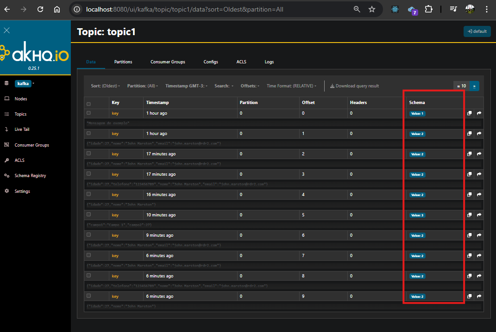
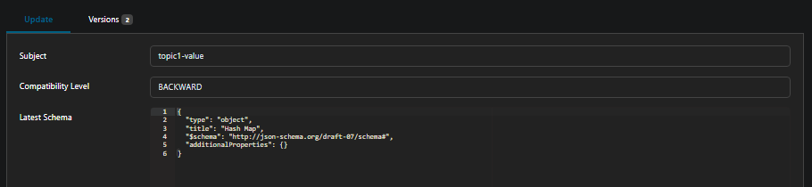

# Schema Registry

## Como executar exemplo

1. Rode para subir os containers: `docker-compose up -d`
2. Rode a classe `src/main/java/com/main/Main.java`
3. Acesse a interface gráfica do **AKHQ** em `http://localhost:8080/`. Você verá o seguinte:

4. Clicando na lupa, é possível visualizar as mensagens postadas, como na imagem abaixo:

5. Clicando no schema, é possível acessar as informações do schema, como na imagem abaixo:

6. Agora é só brincar! =D